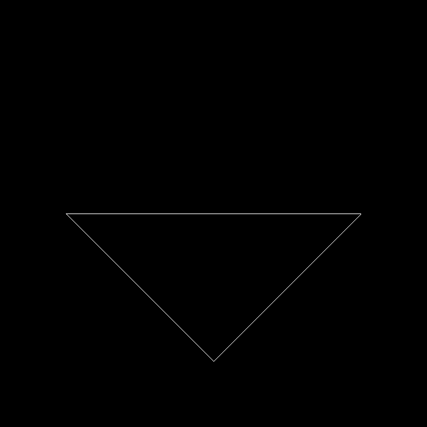

# features
- [x] 正确构建模型矩阵。参考 main.cpp 的 get_model_matrix 函数

- [x] 正确构建透视投影矩阵。参考 main.cpp 的 get_projection_matrix 函数

- [x] 你的代码可以在现有框架下正确运行，并能看到变换后的三角形。

- [x] 当按 A 键与 D 键时，三角形能正确旋转。或者正确使用命令行得到旋转结果图像。

- [x] 在 main.cpp 中构造一个函数，该函数的作用是得到绕任意过原点的轴的旋转变换矩阵。参考 main.cpp 的 get_rotation 函数

# images

