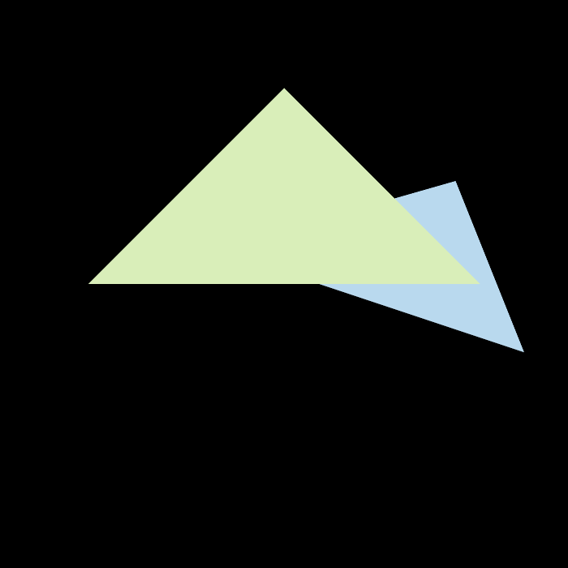

# features
- [x] 正确实现三角形栅格化算法。参考 rasterizer.cpp 的 rasterize_triangle 函数

- [x] 正确测试点是否在三角形内。参考 rasterizer.cpp 的 insideTriangle 函数

- [x] 正确实现 z-buffer 算法, 将三角形按顺序画在屏幕上。参考 rasterizer.cpp 的 rasterize_triangle 函数

- [x] 用 super-sampling 处理 Anti-aliasing。参考 rasterizer.hpp 的 rasterizer 构造函数 和 frame_buffer 函数

# images

> ssaa off

> ssaa on
