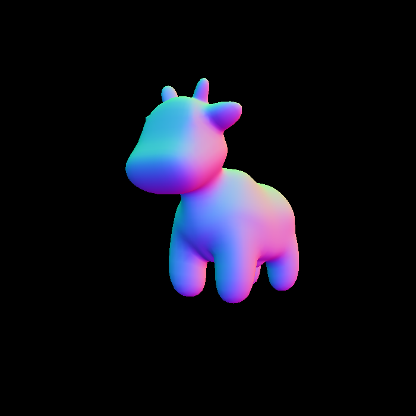
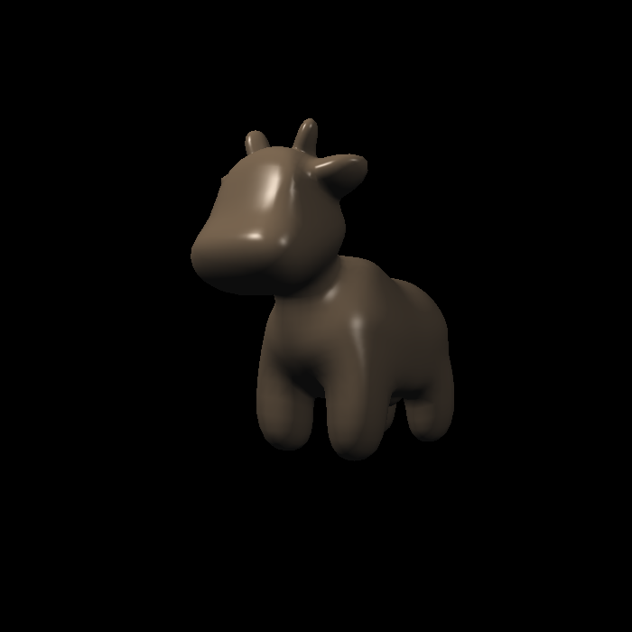
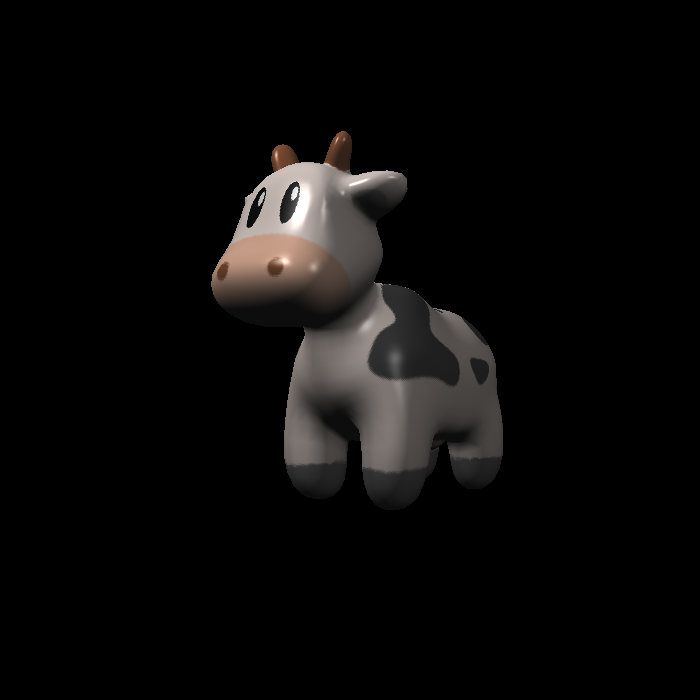
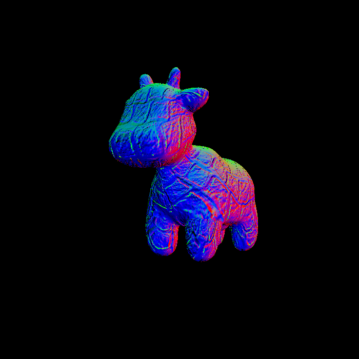
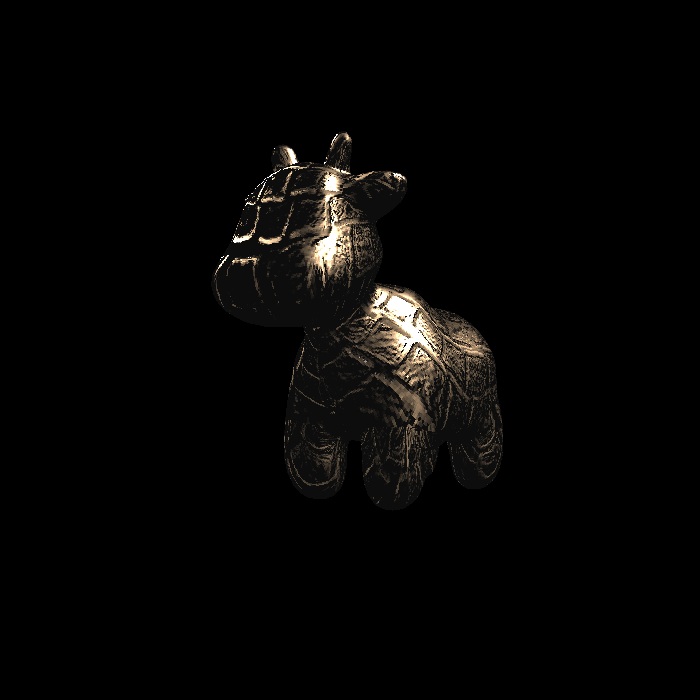

# features
- [x] 提交格式正确，包括所有需要的文件。代码可以正常编译、执行。

- [x] 参数插值。参考 rasterizer.cpp 文件的 rasterize_triangle 函数

- [x] Blinn-phong 反射模型。参考 main.cpp 的 phong_fragment_shader 函数

- [x] Texture mapping。参考 main.cpp 的 texture_fragment_shader 函数

- [x] Bump mapping 与 Displacement mapping。参考 main.cpp 的 bump_fragment_shader 和 displacement_fragment_shader 函数

- [ ] 尝试更多模型。

- [ ] 双线性纹理插值。

# images

> normal

> phong light model

> texture map

> bump map

> displacement map
