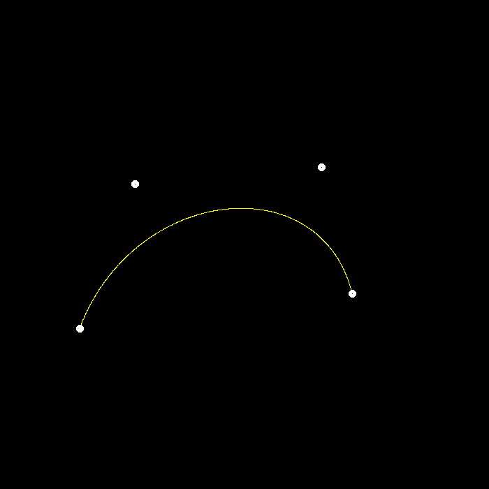
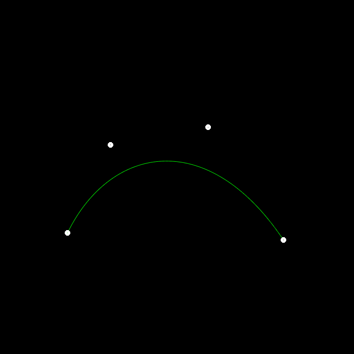

# features
- [x] 提交格式正确，包括所有需要的文件。代码可以正常编译、执行。

- [x] De Casteljau 算法：对于给定的控制点，你的代码能够产生正确的 Bézier 曲线。参考 main.cpp 文件的 recursive_bezier 函数

- [x] 实现对 Bézier 曲线的反走样。 参考 main.cpp 的 bezier 函数

# images

> bezier curve

> bezier curve with aa
