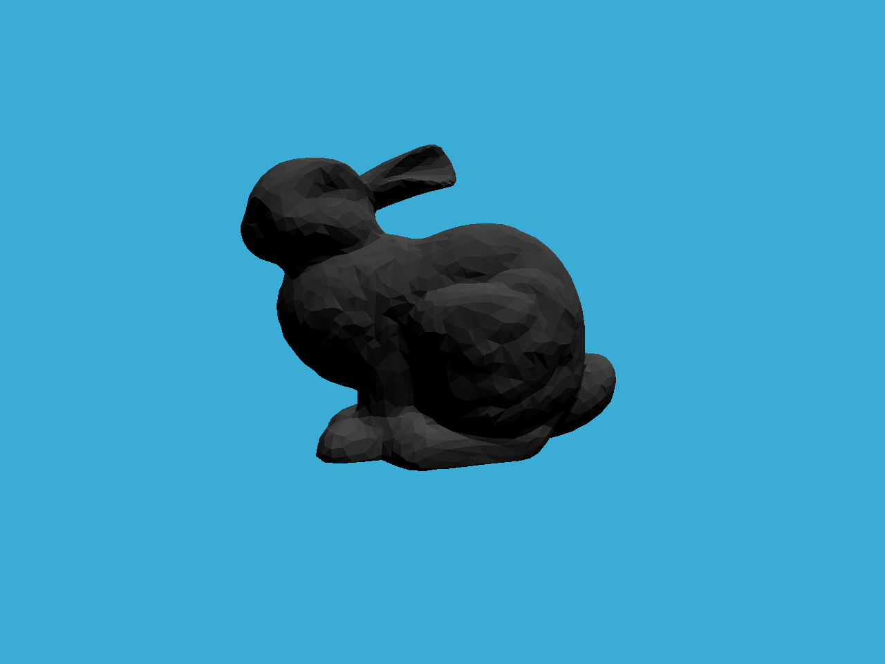

# features
- [x] 提交的格式正确，包含所有必须的文件。代码可以编译和运行。

- [x] 包围盒求交：正确实现光线与包围盒求交函数。参考 Bounds3.hpp 中的 IntersectP 函数。

- [x] BVH 查找：正确实现 BVH 加速的光线与场景求交。参考 BVH.cpp 中的 getIntersection 函数。

- [x] SAH 查找。参考 BVH.cpp 中的 recursiveBuild 函数的 else if (splitMethod == SplitMethod::SAH) 逻辑中。

# SAH acceleration

算法分析如下：
对于父包围盒 `bound`, 其两个子包围盒分别为 `left` `right`, 当 `Cost`(时间复杂度) 最小时为最优分解方案:

` Cost = Cost_trav + Count_left * S_left / S_bound * C_isect  + Count_right * S_right / S_bound * C_isect `

其中：

`Cost_trav` -- 射线与 `bound` 内部所有节点求交测试的时间复杂度

`S_bound` -- `bound` 父包围盒表面积

`C_isect` -- 单次相交测试所需的时间复杂度

`Count_left` -- `left` 子包围盒中包含的节点数

`S_left` -- `left` 子包围盒表面积

`Count_right` -- `right` 子包围盒中包含的节点数

`S_right` -- `right` 子包围盒表面积

# images

