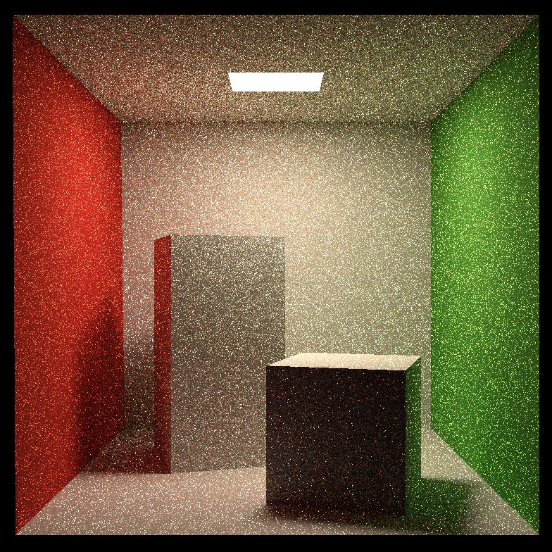

# features
- [x] 提交的格式正确，包含所有必须的文件。代码可以编译和运行。

- [x] Path Tracing：正确实现 Path Tracing 算法。参考 Scene.cpp 中的 castRay 函数。

- [x] 多线程：将多线程应用在 Ray Generation 上。参考 Renderer.cpp 中的 Render 函数。

- [ ] Microfacet：正确实现 Microfacet 材质。

# images

