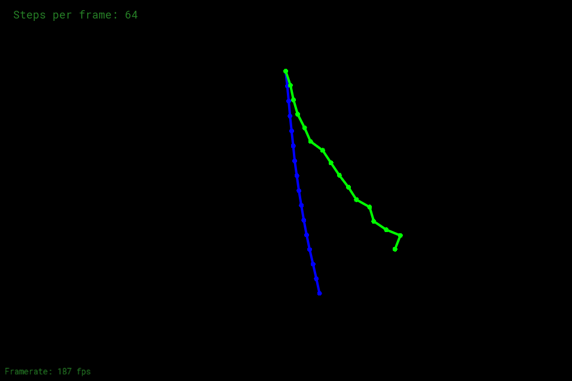

# features
- [x] 提交的格式正确，包含所有必须的文件。代码可以编译和运行。

- [x] 连接绳子约束，正确的构造绳子。参考 rope.cpp 中的 Rope 函数。

- [x] 半隐式欧拉法。参考 rope.cpp 中的 simulateEuler 函数。

- [x] 显式欧拉法。参考 rope.cpp 中的 simulateEuler 函数。

- [x] 显式 Verlet。参考 rope.cpp 中的 simulateVerlet 函数。

- [x] 阻尼。参考 rope.cpp 中的 simulateVerlet 函数。

# images

